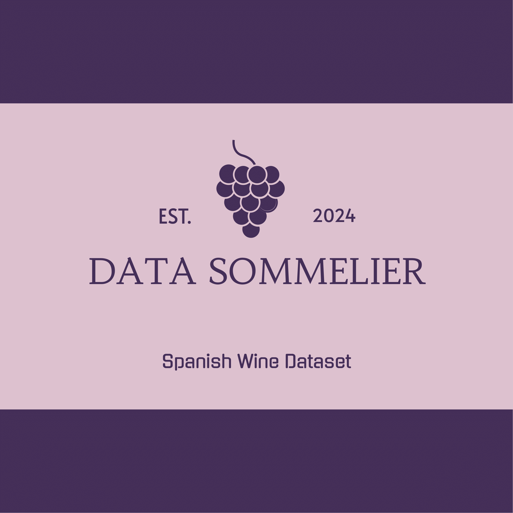
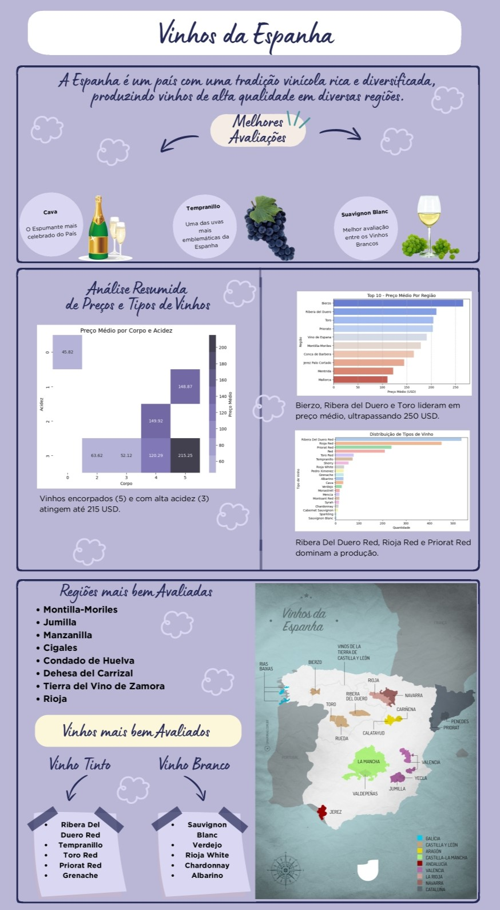

# 🍷 Análise e Predição de Dados de Vinhos Espanhóis 


## ⁉️ Introdução:

Este projeto visa analisar dados de vinhos e fazer previsões com base em características como ano de produção, classificação, preço, tipo e outros atributos relevantes. Utilizando técnicas de Machine Learning e a metodologia CRISP-DM, exploraremos padrões que ajudam a entender a qualidade e o valor dos vinhos.

A análise dos dados transcende o foco exclusivamente comercial, abordando aspectos culturais e regionais associados ao cultivo de uvas e à produção de vinhos. Compreender os fatores que afetam a qualidade do vinho não apenas oferece insights importantes para o setor enológico, mas também contribui para o reconhecimento do valor histórico e ambiental do setor vinícola.

## ☝️ Justificativa:

Aplicar técnicas de ciência de dados em um contexto enológico permite expandir as habilidades dos envolvidos, utilizando ferramentas de análise de dados para revelar tendências e correlações na indústria do vinho. Essa abordagem interdisciplinar aprimora a compreensão das características dos vinhos e demonstra a versatilidade da ciência de dados para resolver questões em áreas como a agricultura e a cultura.

<p align="center">
    
</p>

## 📱 Tecnologias utilizadas:

<div align="center" style="display: inline_block">

 


</div>

## 📋 Atributos do Dataset:

📍 [Link para download do dataset](https://www.kaggle.com/datasets/fedesoriano/spanish-wine-quality-dataset)

| **Coluna**         | **Descrição**                                                                                       |
|--------------------|---------------------------------------------------------------------------------------------------|
| **winery**         | Nome da vinícola que produziu o vinho.                                                            |
| **wine**           | Nome específico ou rótulo do vinho produzido pela vinícola.                                       |
| **year**           | Ano de produção do vinho.                                                                         |
| **rating**         | Avaliação média do vinho, geralmente em uma escala de 1 a 5, baseada em opiniões de consumidores. |
| **num_reviews**    | Número total de avaliações que o vinho recebeu.                                                   |
| **country**        | País onde o vinho foi produzido.                                                                  |
| **region**         | Região específica dentro do país onde o vinho foi produzido.                                      |
| **price**          | Preço do vinho em moeda local (geralmente em dólares ou euros).                                    |
| **type**           | Tipo do vinho, como tinto, branco, rosé, etc.                                                     |
| **body**           | Intensidade do corpo do vinho, em uma escala numérica.                                            |
| **acidity**        | Nível de acidez do vinho, em uma escala numérica.                                                 |


## 🏫 Metodologia:

O Projeto será desenvolvido utilizando a metodologia CRISP-DM, seguindo os seguintes passos:

1. Entendimento de negócio
2. Entendimento de dados
3. Preparação dos dados
4. Modelagem

## 🎨 Graphical Abstract:



## 📑 Etapas do Projeto:

Segue as etapas do projeto conforme os arquivos jupyter localizados na pasta notebooks.

### **0-tips-download**:

Este caderno é dedicado a etapa inicial do projeto, com o objetivo de entender a estrutura dos dados, fazendo a primeira leitura e criando um dicionário de dados. 

### **01-exploratory_data_analysis**:

Este caderno é dedicado à análise exploratória de dados (EDA), com o objetivo de entender a estrutura dos dados e obter insights iniciais. Ele está organizado em três etapas principais:

* **Descrição dos Dados**:
Nesta etapa, os dados são analisados quanto à sua estrutura, verificando a presença de valores faltantes, a distribuição das variáveis, e a criação de um dicionário de dados para facilitar a compreensão das informações.

* **Perguntas e Hipóteses**:
Aqui, são formuladas perguntas iniciais sobre os dados, seguidas de hipóteses baseadas nessas perguntas. Essas hipóteses serão verificadas na etapa final para avaliar sua validade.

* **Geração de Insights**:
Diversos gráficos e análises visuais são criados para responder às perguntas formuladas e testar as hipóteses. Com isso, buscamos confirmar ou refutar as hipóteses, gerando insights relevantes para o contexto do projeto.

### **02-comparative_analysis**:
Este caderno é voltado para a comparação de modelos de regressão, com o objetivo de identificar os melhores modelos para a previsão e classificação dos dados. O processo é dividido em várias etapas cruciais:

* **Tratamento e Transformação de Dados**:
    * A primeira etapa envolve a preparação dos dados para análise. Isso inclui a limpeza de dados faltantes, normalização, codificação de variáveis categóricas e outras transformações necessárias para garantir que os dados estejam prontos para alimentar os modelos.

* **Treinamento e Avaliação de Modelos**:
    * Nessa etapa, diferentes modelos de regressão (como LinearRegression, RandomForestRegressor , SVR, DummyRegressor) são treinados e avaliados. Para cada modelo, são calculadas métricas de desempenho como precisão, MAE, MSE e R², permitindo uma comparação detalhada de sua eficácia.

* **Comparação de Modelos** :
    * Através de uma análise comparativa, são avaliadas as forças e fraquezas de cada modelo com base nos resultados obtidos. Essa comparação abrange tanto as métricas de avaliação quanto as predições de cada modelo, considerando a adequação a diferentes tipos de dados e a capacidade de captura de padrões.

* **Geração de Insights**:
    * Por fim, são extraídos insights com base nas comparações entre os modelos. São apresentados gráficos e tabelas para ilustrar a performance de cada abordagem, destacando as melhores opções para o problema em questão. O objetivo é entender quais modelos têm o melhor desempenho em termos de generalização, precisão e adequação ao contexto dos dados.

## 🧑‍💻 Cientistas de Dados:
 - [Layssa Rodrigues](https://github.com/laayrd) / [Carlos Campos](https://github.com/carloscamposb)/ [Micael Lima](https://github.com/micaellimaj) / [Julia Chaves](https://github.com/liapsps) / [Lucas Pinheiro](https://github.com/Lucas-p00)

   
## 🗂️ Organização de diretórios:


```
.
├── data/              # Diretório contendo todos os arquivos de dados
│   ├── external/      # Arquivos de dados de fontes externas
│   ├── interim/       # Arquivos de dados intermediários
│   ├── processed/     # Arquivos de dados processados
│   └── raw/           # Arquivos de dados originais, imutáveis
├── docs/              # Documentação gerada através da biblioteca mkdocs
├── models/            # Modelos treinados e serializados, predições ou resumos de modelos
├── notebooks/         # Diretório contendo todos os notebooks utilizados nos passos
├── references/        # Dicionários de dados, manuais e todo o material exploratório
├── src/               # Código fonte utilizado nesse projeto
│   ├── data/          # Classes e funções utilizadas para download e processamento de dados
│   ├── deployment/    # Classes e funções utilizadas para implantação do modelo
│   └── model/         # Classes e funções utilizadas para modelagem
├── app.py             # Arquivo com o código da aplicação do streamlit
├── Procfile           # Arquivo de configuração do heroku
├── pyproject.toml     # Arquivo de dependências para reprodução do projeto
├── poetry.lock        # Arquivo com sub-dependências do projeto principal
├── README.md          # Informações gerais do projeto
└── tasks.py           # Arquivo com funções para criação de tarefas utilizadas pelo invoke

```

## ✅ Conclusão:

Este projeto demonstrou a aplicação de técnicas de aprendizado de máquina para prever os preços de vinhos com base em características como ano de produção, avaliação média, número de avaliações, país, região, e tipo do vinho. Ao explorar diferentes modelos preditivos, como DummyRegressor, LinearRegression, SVR, e RandomForestRegressor, foi possível avaliar seus desempenhos em termos de capacidade preditiva, variabilidade nas previsões e adequação aos padrões presentes nos dados.
