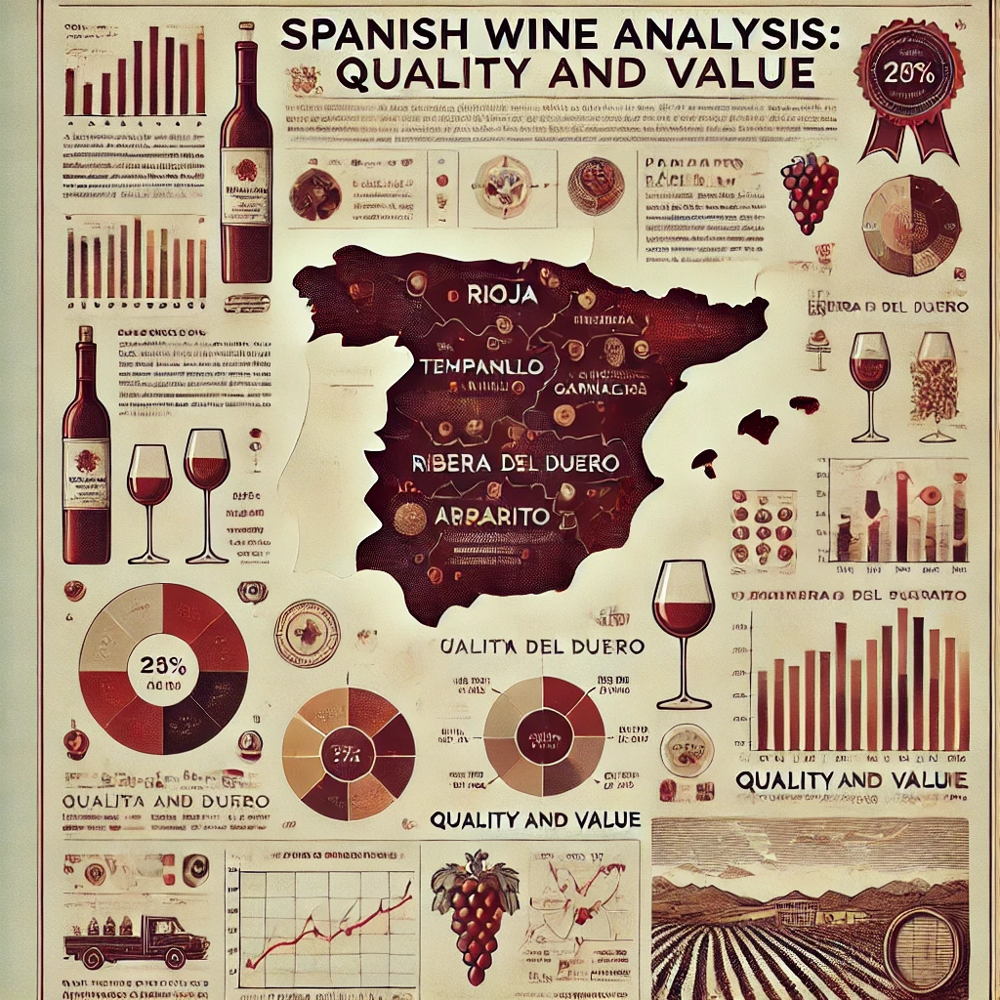

# Análise e Previsão de Dados de Vinhos Espanhois

Este projeto visa analisar dados de vinhos e fazer previsões com base em características como ano de produção, classificação, preço, tipo e outros atributos relevantes. Utilizando técnicas de Machine Learning e a metodologia CRISP-DM, exploraremos padrões que ajudam a entender a qualidade e o valor dos vinhos.

A análise dos dados transcende o foco exclusivamente comercial, abordando aspectos culturais e regionais associados ao cultivo de uvas e à produção de vinhos. Compreender os fatores que afetam a qualidade do vinho não apenas oferece insights importantes para o setor enológico, mas também contribui para o reconhecimento do valor histórico e ambiental do setor vinícola.

Aplicar técnicas de ciência de dados em um contexto enológico permite expandir as habilidades dos envolvidos, utilizando ferramentas de análise de dados para revelar tendências e correlações na indústria do vinho. Essa abordagem interdisciplinar aprimora a compreensão das características dos vinhos e demonstra a versatilidade da ciência de dados para resolver questões em áreas como a agricultura e a cultura.

## Desenvolvedores
 - [Layssa Rodrigues](https://github.com/laayrd)
 - [Carlos Campos](https://github.com/carloscamposb)
 - [Micael Lima](https://github.com/micaellimaj)
 - [Julia Chaves](https://github.com/liapsps)
 - [Lucas Pinheiro](https://github.com/Lucas-p00)